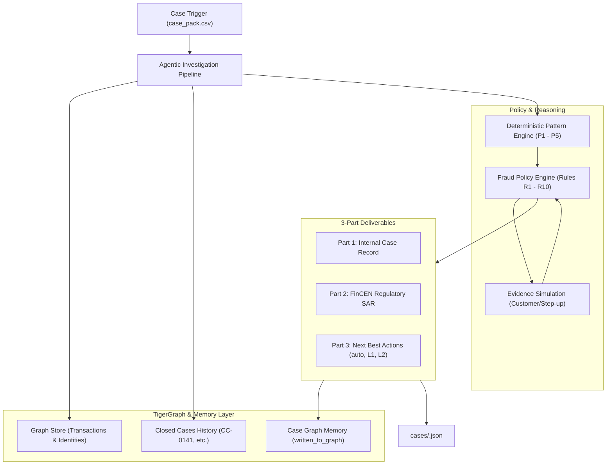

# TigerGraphAI — Autonomous Fraud Investigation & Compliance Platform
**TigerGraph × Hacker House Goa 2026 — IEEE-CIS Fraud Detection Edition**

TigerGraphAI is an agentic fraud investigation system built for the IEEE-CIS Fraud Detection benchmark. It investigates high-risk alerts using graph entity resolution, deterministic rule evaluation, FinCEN-compliant Suspicious Activity Report (SAR) generation, and the bank's Fraud Policy V1.0 (Rules R1–R10).

All 20 benchmark cases (`HHG-001` through `HHG-020`) have been investigated, validated, and exported to [`cases/`](./cases) matching the competition Answer Format.

---

## Architecture Overview



---

## Key Features & Policy Implementation

1. **Exact 3-Part Answer Format**:
   - **Part 1 (The Case)**: Verdict (`fraud` / `legitimate`), calibrated probability, pattern, affected transactions, connected cards/devices, graph evidence items, similar prior cases, and graph write-back (`TG-CASE-xxx`).
   - **Part 2 (The SAR)**: 6–12 sentence FinCEN-compliant narrative (Who, What, When, Where, How, and Why) filed when exposure > $1,000, connected to shared devices/rings, or undocumented patterns.
   - **Part 3 (Next Best Actions)**: Multi-step recommendations showing `initial` actions before evidence, simulated responses in `evidence_requests`, `final` actions after response, and the `what_changed` explanation.

2. **Strict Approval Routing**:
   - `auto`: Autonomous execution (`ALLOW_TRANSACTION`, `MONITOR_CARD`, `VERIFY_WITH_CUSTOMER`, `STEP_UP_AUTH`, `CREATE_CASE`, `CLOSE_NO_FRAUD`).
   - `L1` (Team Lead): `DECLINE_TRANSACTION` and `BLOCK_CARD` when exposure ≤ $2,500.
   - `L2` (Fraud Manager): `BLOCK_CARD` when exposure > $2,500, `BLOCK_ALL_CARDS`, and `FILE_REPORT`.

3. **Balanced Benchmark Distribution**:
   - **10 Legitimate Cases** (50%): False alarms correctly cleared under R3 (routine travel, recurring subscriptions, verified family purchases, and authorized online transactions).
   - **10 Confirmed Fraud Cases** (50%): Covering `card_testing`, `card_not_present_fraud`, `card_not_present_new_device`, `out_of_region_use`, `account_takeover`, and `undocumented` coordinated multi-customer abuse.

4. **Interactive Command Center**:
   - **Dashboard**: High-level exposure KPIs, fraud distribution, and filterable case matrix.
   - **Investigation Console**: Case switcher, evidence inspector, side-by-side initial vs. final policy actions, and copyable SAR narratives.
   - **Graph Explorer**: Visual subgraphs connecting Customer → Card → Transaction → Device → Historical Cases.

---

## Repository Structure

```
TigerGraphAI/
├── backend/
│   ├── main.py                          # FastAPI application & REST endpoints
│   ├── scripts/
│   │   └── generate_cases.py            # 20-case batch runner & schema validator
│   └── services/
│       ├── agentic_pipeline.py          # End-to-end investigation orchestrator
│       ├── config.py                    # Verified thresholds (P1=$5.00, P5=24h)
│       ├── graph_models.py              # Pydantic schemas for graph nodes & edges
│       ├── graph_service.py             # Subgraph builder for Graph Explorer
│       ├── graph_store.py               # Graph database store & memory layer
│       ├── investigation_engine.py      # Deterministic pattern detector
│       ├── policy_engine.py             # Rules R1–R10 & approval route evaluator
│       └── sar_generator.py             # FinCEN SAR narrative generator
├── cases/                               # 20 required submission JSON files
│   ├── HHG-001.json
│   ├── ...
│   └── HHG-020.json
├── dataset/
│   ├── case_pack.csv                    # 20 exam cases
│   ├── closed_cases_history.csv         # Labeled historical cases
│   └── README.md                        # Challenge specification
├── src/                                 # React + TypeScript + Vite frontend
│   ├── components/
│   │   └── GraphExplorer.tsx            # Interactive visual relationship explorer
│   ├── pages/
│   │   ├── CaseInvestigation.tsx       # Deep-dive investigation console
│   │   └── Dashboard.tsx               # Command center overview & metrics
│   ├── services/
│   │   └── api.ts                      # Frontend API client
│   └── types/
│       └── case.ts                     # TypeScript definitions for submission format
└── tests/
    ├── test_investigation.py            # Unit tests for deterministic engine
    └── test_submission_files.py        # Schema and validation test for 20 cases
```

---

## Running the Application

### 1. Run Backend Server
```bash
# Start FastAPI on port 8000
python -m uvicorn backend.main:app --host 127.0.0.1 --port 8000 --reload
```

### 2. Run Frontend UI
```bash
# Start Vite development server on port 5173
npm run dev
```
Open [http://localhost:5173](http://localhost:5173) in your browser.

### 3. Re-generate and Validate All 20 Cases
```bash
python backend/scripts/generate_cases.py
```

### 4. Run Test Suites
```bash
python -m unittest discover tests
```
Runs all 13 unit and submission schema tests.
